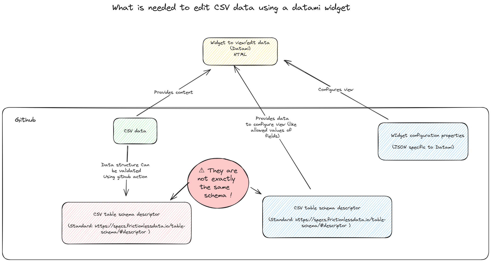

# datami-tests

Testing Datami widget to edit and validate CSV files [https://datami.multi.coop/](https://datami.multi.coop/).

## purpose

Demonstrate and document how we can use Datami and other components to:

- ease the edition of a csv file stored in Github 
- constraint the display of fields in the Datami widget
- investigate how we can use github actions to ensure that the csv file structure and or content is valid according to a model.

The approach of Datami component is 

1. to rely on Github to store the CSV file
2. offer a html widget to visualize or edit content of the file for users who may not want to use Github directly
3. automate the push of modifications to the data done via the widget as Github pull requests



## content

- examples/csv/data: data files and related resources files to validate in CI
  - data (csv file):[project-list.csv](https://github.com/demeringo/datami-tests/blob/main/examples/csv/data/project-list.csv)
  - definition (model file) for data validation (CLI or CI) [project-list.resources.yaml](https://github.com/demeringo/datami-tests/blob/main/examples/csv/data/project-list.resources.yaml)
- examples/csv/model: model for the csv data (be used by the widget)
  - Table schema [project-list.frictionless-table-schema.json](https://github.com/demeringo/datami-tests/blob/main/examples/csv/model/project-list.frictionless-table-schema.json)
- example/csv/widget: widget and widget configuration examples
  - configuration file for the widget: [project-list.fields-custom-properties.json](https://github.com/demeringo/datami-tests/blob/main/examples/csv/widget/project-list.fields-custom-properties.json)
  - configured widget:[project-list-widget.html](https://github.com/demeringo/datami-tests/blob/main/examples/csv/widget/project-list-widget.html)
- .github/workflows: actions to automate validation
  - Example github action that validates data file on pull request [validate-sample-data.yml](https://github.com/demeringo/datami-tests/blob/main/.github/workflows/validate-sample-data.yml) 

## Validating a data file locally

### Install frictionless package

```sh
pip install "frictionless[excel,json]" --pre
```

### Validate data

Example with a file that contains invalid / not authorized values.

Line 3 of data contains a value `csharp` which is not in the pattern of authorized values  (see project-list.resources.yaml) where the pattern or allowed values / types are defined.

```csv
Boaviztapi,https://github.com/Boavizta/,ready,csharp
```

```sh
cd examples/csv/data
frictionless validate project-list.resources.yaml

─────────────────────────────────────────────────────── Dataset ────────────────────────────────────────────────────────
                       dataset
┏━━━━━━━━━━━━━━┳━━━━━━━┳━━━━━━━━━━━━━━━━━━┳━━━━━━━━━┓
┃ name         ┃ type  ┃ path             ┃ status  ┃
┡━━━━━━━━━━━━━━╇━━━━━━━╇━━━━━━━━━━━━━━━━━━╇━━━━━━━━━┩
│ project-list │ table │ project-list.csv │ INVALID │
└──────────────┴───────┴──────────────────┴─────────┘
──────────────────────────────────────────────────────── Tables ────────────────────────────────────────────────────────
                                                      project-list
┏━━━━━┳━━━━━━━┳━━━━━━━━━━━━━━━━━━┳━━━━━━━━━━━━━━━━━━━━━━━━━━━━━━━━━━━━━━━━━━━━━━━━━━━━━━━━━━━━━━━━━━━━━━━━━━━━━━━━━━━━━┓
┃ Row ┃ Field ┃ Type             ┃ Message                                                                             ┃
┡━━━━━╇━━━━━━━╇━━━━━━━━━━━━━━━━━━╇━━━━━━━━━━━━━━━━━━━━━━━━━━━━━━━━━━━━━━━━━━━━━━━━━━━━━━━━━━━━━━━━━━━━━━━━━━━━━━━━━━━━━┩
│ 3   │ 4     │ constraint-error │ The cell "csharp" in row at position "3" and field "languages" at position "4" does │
│     │       │                  │ not conform to a constraint: constraint "pattern" is "^(rust|python|docker|other\   │
│     │       │                  │ tek)?(\|(rust|python|docker|other\ tek))*$"                                         │
└─────┴───────┴──────────────────┴─────────────────────────────────────────────────────────────────────────────────────┘

```

After fixing the data file (replace the `csharp` value by `python|docker`).

```csv
Boaviztapi,https://github.com/Boavizta/,ready,python|docker
```

```sh
frictionless validate project-list.resources.yaml
─────────────────────────────────────────────────────── Dataset ────────────────────────────────────────────────────────
                      dataset
┏━━━━━━━━━━━━━━┳━━━━━━━┳━━━━━━━━━━━━━━━━━━┳━━━━━━━━┓
┃ name         ┃ type  ┃ path             ┃ status ┃
┡━━━━━━━━━━━━━━╇━━━━━━━╇━━━━━━━━━━━━━━━━━━╇━━━━━━━━┩
│ project-list │ table │ project-list.csv │ VALID  │
└──────────────┴───────┴──────────────────┴────────┘
```

## Validate a data file in CI

See sample github action (`.github/workflows/validate-sample-data.yml`)

```yaml
jobs:

  # Validate

  validate:
    runs-on: ubuntu-latest
    steps:
      - name: Checkout repository
        uses: actions/checkout@v2
      - name: Validate data
        uses: frictionlessdata/repository@v2
        with:
          resources: examples/csv/data/project-list.resources.yaml
```

## References

- [https://datami.multi.coop/](https://datami.multi.coop/)
- [Datami parameter doc](https://datami-docs.multi.coop/docs-gitfile?locale=en#keys-for-the-options-parameter-for-csv-and-tsv-files)
- [Table Schema | Data Package (v1)](https://specs.frictionlessdata.io//table-schema/)
- [frictionless-ci | Frictionless Repository](https://repository.frictionlessdata.io/)